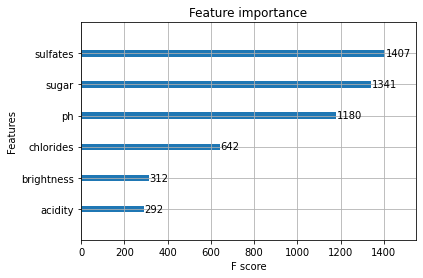
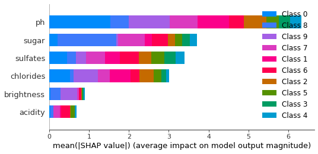

# Wine Predictions Assessment
A technical assessment to predict wine ratings from a given dataset

Robert Nakano

## Installation

1. Install packages from requirements.txt using `pip install -r requirements.txt`

2. The following python files can be run in numeric order from a VSCode Python interactive environment. A notebook file (Notebook.ipynb) includes output of all code for convenience of evaluation.

3. Predictions can be accessed from your browser when running 2_microservice. Use text.xlsx for quickly copying preformatted urls.  

## 0_EDA

Using Pandas Profiling Report (see wine_profiling_report.html), we can see quick descriptive statistics. 5000 observations across 7 variables (1 target, 6 feature). Notably, ph and acidity are highly correlated, which makes sense, as ph is another metric for acidity. Acidity is also missing 494 data points. 

Ratings seem roughly normal centered around 4, with a slight skew right. Chlorides are negatively correlated with ratings and ph/acidity are positively correlated. This pattern may inform the model.

It seems reasonable for the presence of chlorides (yielding a salty flavor) to influence ratings negatively ([http://www.scielo.br/scielo.php?script=sci_arttext&pid=S0101-20612015000100095#:~:text=Wine%20contains%20from%202%20to,2003%3B%20Maltman%2C%202013](http://www.scielo.br/scielo.php?script=sci_arttext&pid=S0101-20612015000100095#:~:text=Wine%20contains%20from%202%20to,2003%3B%20Maltman%2C%202013)).) 

The interaction between sweetness and acidity may also be relevant, as  "Total acidity tells us the concentration of acids present in wine, whereas the pH level tells us how intense those acids taste." ([https://winefolly.com/deep-dive/understanding-acidity-in-wine/](https://winefolly.com/deep-dive/understanding-acidity-in-wine/))

## 1_Model

Trains and saves an XGBoost model on the wine data. The final model fit on all data is saved as xgb_full_train.json for use in the microservice.

## 2_Microservice

A simple Flask service was created to serve the necessary predictions. Data validation for floats was included.

# Questions

## How did you choose your model?

I chose XGBoost due to its reputation for great performance with minimal training costs. Because the dataset contains 5000 rows, deep learning models were not favored. Additionally, a 5-fold cross-validation procedure was implemented with randomized cross validation, for a balance of optimization and expediency.

Due to the imbalance of the training set, utilizing sample weights in fitting is a notable addition to the model.

## How well do you expect your model to perform in practice?

Although predictions seem reasonable given the data (for a quick test, copy and paste urls from the text.xlsx model), the model requires further tuning. 6 feature variables for evaluating the quality of a wine seem limited, which is represented in our holdout dataset (excluded from cross validation) performance with an accuracy of 0.30.

### Metrics on Holdout Dataset from CV Fit Model:

  precision    recall  f1-score   support

           1       0.31      0.94      0.46        51

           2       0.29      0.35      0.32       151

           3       0.35      0.23      0.28       204

           4       0.40      0.21      0.28       261

           5       0.22      0.18      0.20       157

           6       0.32      0.35      0.33       119

           7       0.24      0.44      0.31        41

           8       0.16      0.50      0.25        14

           9       0.00      0.00      0.00         2

          10       0.00      0.00      0.00         0

    accuracy                           0.30      1000

   macro avg       0.23      0.32      0.24      1000

weighted avg       0.32      0.30      0.29      1000

## Which of the six features above is least important?

From our final model, acidity seems to be the least involved in creating notable splits with the smallest impact on model output magnitude based on the SHAP value. The high correlation between ph and acidity lends to this reasoning. Brightness does also seem to be a limited contributor.

## What would you do if you had more time to work on this problem?

One change I would make is to structure the problem as a regression problem instead of multi-class classification. While I anticipate the model to perform similarly, because the rating data is ordinal, the interpretability of the metrics and final interpretations (e.g. SHAP values) would be more intuitive. Final predictions could be rounded to integers within the range of ratings.

I imagine user tastes for wines is a subjective problem. Given more time, I would love to study the space and understand more about the domain specific knowledge. I would like to perform more research on the factors that are traditionally considered to make wines good and user research to gain better insight.

I also would request the column for which user rated each wine. This would allow me to generate user embeddings for personalized predictions, and utilize recommender system techniques. 

If user data was not available, I would still like to compare the performance of other algorithms, perhaps a linear model, SVM, LDA, etc.. Given more time, I would consider gridsearchcv or Bayesian hyperparameter optimization, although simply increasing the training time (number of iterations) for a randomized cv search would lead to improvement.  I would also consider removing acidity from the model due to high cardinality and rerunning. 

Finally, given more time, exploring the context of the problem also comes to mind. Why are we generating these predictions and how do they serve? Can we get a prototype of the product out to users for explicit and/or implicit feedback? Are there any technical requirements or constraints I may be ignoring when choosing my modeling/serving strategy?

# References

sklearn Class Weights

[https://scikit-learn.org/stable/modules/generated/sklearn.utils.class_weight.compute_sample_weight.html](https://scikit-learn.org/stable/modules/generated/sklearn.utils.class_weight.compute_sample_weight.html) 

sklearn RandomizedSearchCV

[https://scikit-learn.org/stable/modules/generated/sklearn.model_selection.RandomizedSearchCV.html#sklearn.model_selection.RandomizedSearchCV](https://scikit-learn.org/stable/modules/generated/sklearn.model_selection.RandomizedSearchCV.html#sklearn.model_selection.RandomizedSearchCV)

Flask Documentation

[https://flask.palletsprojects.com/en/1.1.x/](https://flask.palletsprojects.com/en/1.1.x/) 

Flask Parameter Validation Package

[https://github.com/Ge0rg3/Flask-Parameter-Validation](https://github.com/Ge0rg3/Flask-Parameter-Validation) 

XGBoost Documentation

[https://xgboost.readthedocs.io/en/latest/](https://xgboost.readthedocs.io/en/latest/) 

Shap Documentation

[https://shap.readthedocs.io/en/latest/index.html](https://shap.readthedocs.io/en/latest/index.html) 

Pandas Profiling Github

[https://github.com/pandas-profiling/pandas-profiling](https://github.com/pandas-profiling/pandas-profiling) 

